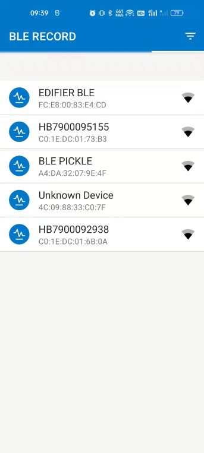
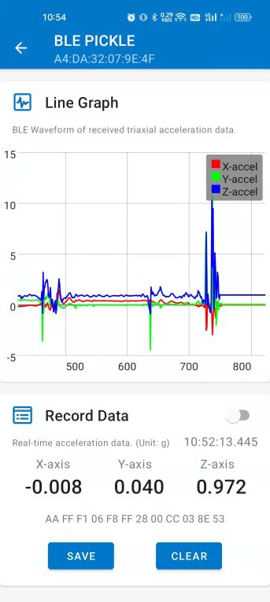

# BLE Recorder

BLE Recorder is an application developed targeting an audience of developers who are new to 
Bluetooth Low Energy. 

The application is mainly used to collect triaxial acceleration data from BLE devices. Users can observe the waveform of the received acceleration data in real time. The collected data can be recorded in a CSV file, and the system application can be called for file sharing.

 

It demonstrates how to the **BleManager** class from 
[Android BLE Library](https://github.com/NordicSemiconductor/Android-BLE-Library/) 
library can be used from View Model 
(see [Architecture Components](https://developer.android.com/topic/libraries/architecture/index.html)).

## BLE Devices Service

Service UUID: `f000fff0-0451-4000-b000-000000000000`

A simplified proprietary service by Nordic Semiconductor, containing two characteristics one to 
control LED 3 and Button 1:

- First characteristic of the triaxial acceleration data.
  - UUID: **`f000fff1-0451-4000-b000-000000000000`**
  - Value: **`AA FF F1 06 08 00 1C 00 C4 03 7F 58`** 
- Second characteristic of the electric quantity of the equipment.
  - UUID: **`f000fff2-0451-4000-b000-000000000000`**
  - Value: **`0~100`** 
  

## Requirements

* This application depends on [Android BLE Library](https://github.com/NordicSemiconductor/Android-BLE-Library/).
* Android 4.3 or newer is required.
* Any nRF5 DK is required in order to test the BLE Blinky service. The service can also be emulated
using nRF Connect for Android, iOS or Desktop.

## Installation and usage

The device should appear on the scanner screen after granting required permissions.

### Required permissions

On Android 6 - 11 nRF Blinky will ask for Location Permission and Location services. 
This permission is required on Android in order to obtain Bluetooth LE scan results. The app does not
use location in any way and has no Internet permission so can be used safely.

This permission is not required from Android 12 onwards, where new 
[Bluetooth permissions](https://developer.android.com/guide/topics/connectivity/bluetooth/permissions)
were introduced. The `BLUETOOTH_SCAN` permission can now be requested with 
`usesPermissionFlags="neverForLocation"` parameter, which excludes location related data from the
scan results, making requesting location not needed anymore.